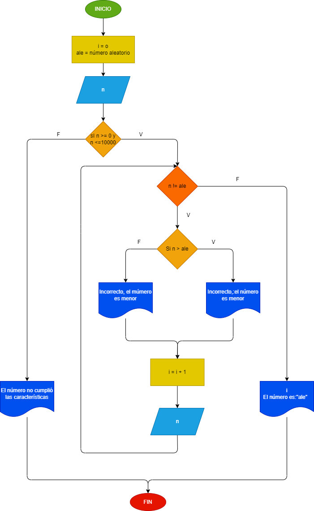

# adivinar_numero
# Ejercicio de adivinar número 
## Relizar un programa que genere un número aleatorio el cual se deba adivinar. Que cada vez que se digite un número sume el intento y que cuando se escriba el número correcto imprima cuantos intentos se utilizaron. Además que cada vez que se digite un número diga si el número es mayor o menor para encontrarlo más rápido.
 